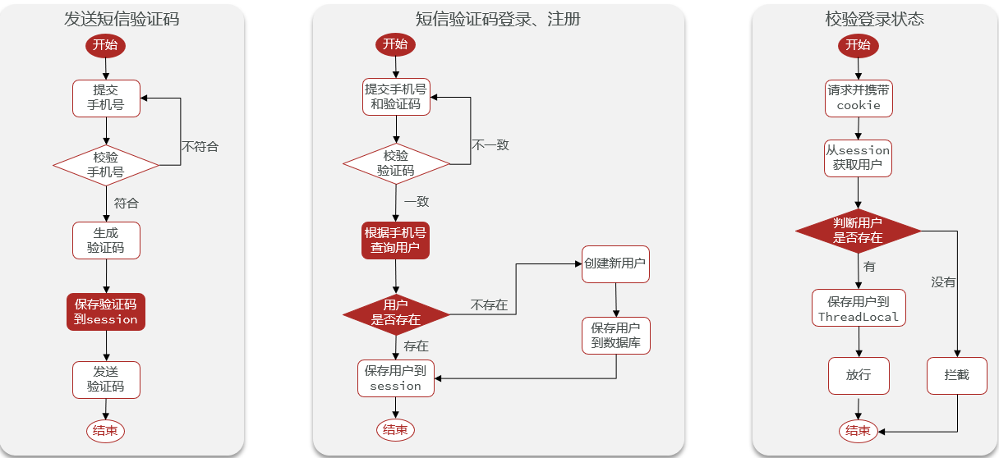
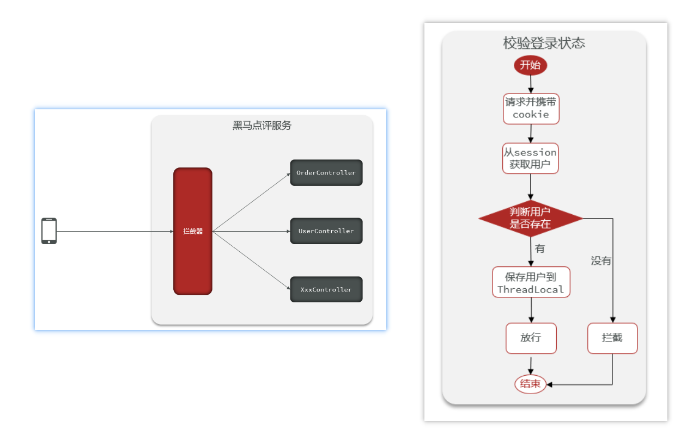
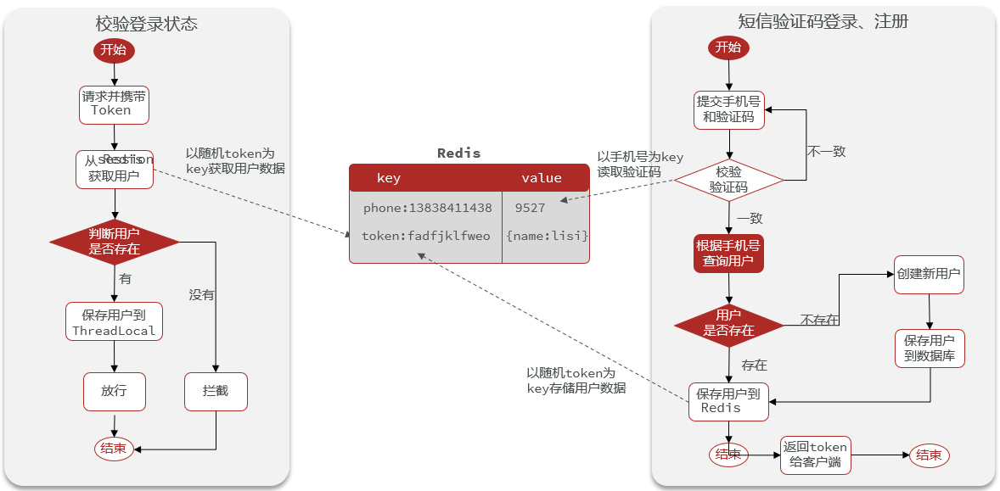
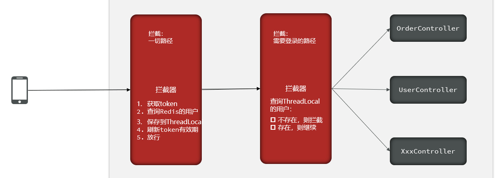

# 代码使用说明

## 分支说明

- master : 初始化分支，实战篇的初始代码，建议大家以这个分支作为自己开发的基础代码

## 使用说明

克隆项目

```git
git clone https://gitee.com/L1w31oO/hmdp.git
```

切换分支

```git
git checkout branch
```
## 登录功能
### 短信验证码登录

### 拦截器

### 基于Redis实现短信验证码登录

### 配置登录拦截器 && 刷新token的拦截器
